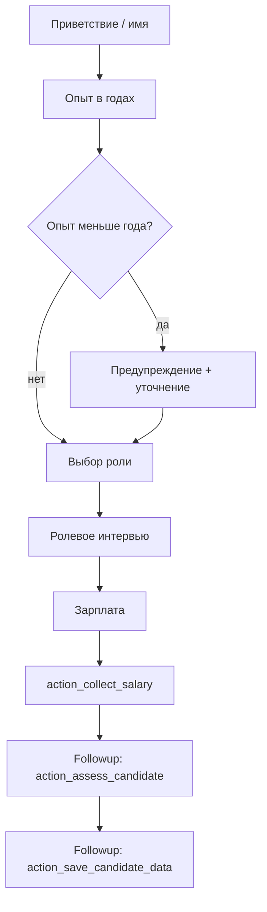

# HR Interview Bot (Rasa)

## 1. Описание проекта

**HR Interview Bot** - чат-бот для **первичного интервью** кандидатов на роли в ML- и data-команде (MVP). Бот ведет пошаговый диалог на русском языке, собирает ответы в слоты, **оценивает профиль по выбранной одной роли** (score 0-100), выводит **объяснимый итог** (сильные/слабые стороны, предупреждения о противоречиях, зарплатный комментарий) и сохраняет результат в JSON для рекрутера.

Проект реализован на **Rasa 3.x** (язык ассистента: `ru`). Подключение к мессенджерам задается через `credentials.yml` (по умолчанию в репозитории задекларирован **REST channel**; Telegram и другие каналы можно добавить по [документации Rasa](https://rasa.com/docs/rasa/messaging-and-voice-channels)).

## 2. Поддерживаемые роли

Кандидат **выбирает одну** из пяти ролей (кнопка или текст / entity `desired_role`):

| Slug | Роль |
|------|------|
| `data_scientist` | Data Scientist |
| `data_engineer` | Data Engineer |
| `data_analyst` | Data Analyst |
| `project_manager` | Project Manager |
| `mlops_engineer` | MLOps Engineer |

Итоговая оценка строится **только по выбранной роли** (нет ranking по всем пяти направлениям одновременно). Уровень **Junior / Middle / Senior** выводится автоматически из заявленного стажа (лет).

## 3. Основные возможности

- Сбор **имени**, **опыта (лет)**, **целевой роли**, **ролевого блока вопросов** (расширенный чек-лист под DS / DE / DA / PM / MLOps), **зарплатных ожиданий**.
- Интент **`answer_interview_open`** для развернутых свободных ответов на профильные вопросы (наряду с узкими интентами вроде `answer_sql_level`, `answer_tools` и т.д.).
- **Scoring 0-100** с эвристиками по слотам (опыт, стек, production, soft skills и др.).
- **Решение по порогам**: Strong Hire (80-100), Hire (60-79), Maybe (40-59), Reject (менее 40); слот `is_suitable` = true, если решение не Reject.
- **Explainability**: список сильных/слабых сторон, рекомендация, **consistency warnings** (противоречия в ответах).
- **Оценка зарплаты**: сравнение с ориентирами по роли и уровню, блок **salary-to-skill**.
- **Сохранение сессии** в `data/candidates/<sender_id>_<timestamp>.json` после оценки или при досрочном выходе (см. `action_save_candidate_data`).
- Повтор вопроса (`ask_repeat`), обработка вне темы (`out_of_scope`), остановка интервью (`stop_interview`), fallback.

Подробная установка Python и зависимостей без готового `requirements.txt` - в **`SETUP_PYTHON.md`** (Rasa поддерживает Python **3.8-3.10**).

## 4. Пользовательский сценарий (упрощенно)

Типичная последовательность (без привязки к конкретному каналу):

```text
Привет
[готовность]
Иван
3 года
Data Analyst
[ответы на вопросы по роли - текстом или кнопками]
180000
```

В конце диалога бот отправляет **Candidate Summary** (роль, уровень, score, решение, сильные/слабые стороны, замечания, зарплатный комментарий) и прощальное сообщение в зависимости от `is_suitable`.

## 5. Логика диалога

Диалог управляется **правилами (`rules.yml`)** и **историями (`stories.yml`)** + **custom actions** в `actions/actions.py`. **Rasa Forms в этом проекте не используются** - последовательность вопросов задается слотом `last_question_key` и функцией `_next_question_response`.



### Контекстная обработка

Ответы маппятся в слоты с учетом **текущего вопроса** (`last_question_key`) и интента; часть полей нормализуется эвристиками (`_norm_python_level`, `_norm_sql_level`, `_norm_bool`, парсинг зарплаты и т.д.).

| Ситуация | Поведение |
|----------|-----------|
| Опыт | Число из текста, «меньше года», «нет опыта» |
| Роль | Entity `desired_role` или ключевые слова в `action_collect_role` |
| Зарплата | `150000`, `200к`, сущность `salary_expectation` |
| Свободный текст на вопрос | Интент `answer_interview_open` или специализированный интент |

## 6. Скоринговая модель (MVP)

Общий **score 0-100** считается в `actions/actions.py` **отдельно для каждой роли** (функции `_score_data_scientist`, `_score_data_engineer`, и т.д.). Внутри учитываются, в частности:

- стаж и автоматический **уровень** Junior / Middle / Senior;
- **корректировка score по уровню** (`_apply_level_score_adjustment`);
- **soft skills** (короткая эвристика по тексту ответов, до 15 баллов);
- штрафы за пробелы вместо жесткого «reject только из-за одного флага» там, где это ослаблено в логике MVP.

### Решение по score

| Score | Решение (слот `hire_decision`) |
|------:|--------------------------------|
| 80-100 | Strong Hire |
| 60-79 | Hire |
| 40-59 | Maybe |
| 0-39 | Reject |

### Предупреждения и зарплата

- **`consistency_warnings`** - строки о возможных противоречиях (например, мало опыта при «продвинутом Python»).
- **`_salary_assessment`** - вилка по рынку для роли и уровня + **salary-to-skill** при наличии score.

## 7. Архитектура

```text
Пользователь (REST / другой канал из credentials.yml)
        |
        v
 Rasa Server (NLU + policies)
        |
        +--> data/nlu.yml, data/rules.yml, data/stories.yml
        |
        +--> domain.yml (intents, entities, slots, responses, actions)
        |
        v
 Action Server (endpoints.yml -> localhost:5055)
        |
        +--> actions/actions.py
                 - маршрутизация вопросов
                 - парсинг и слоты
                 - скоринг, summary, сохранение JSON
```

## 8. Структура проекта

```text
.
├── actions/
│   └── actions.py          # custom actions, скоринг, сохранение кандидатов
├── data/
│   ├── nlu.yml
│   ├── rules.yml
│   ├── stories.yml
│   └── candidates/         # JSON-артефакты после интервью (создается при сохранении)
├── tests/
│   └── test_stories.yml    # при необходимости замените на сценарии этого бота
├── config.yml
├── credentials.yml
├── domain.yml
├── endpoints.yml
├── SETUP_PYTHON.md         # установка окружения и Rasa без Anaconda
└── README.md
```

### Основные файлы

| Файл | Назначение |
|------|------------|
| `domain.yml` | Intents, entities, slots, responses, список custom actions |
| `data/nlu.yml` | Примеры для NLU, синонимы ролей |
| `data/rules.yml` | Правила этапов (приветствие, роль, интервью по стадии, зарплата, fallback) |
| `data/stories.yml` | Истории для обучения политик (в т.ч. длинные сценарии по ролям) |
| `actions/actions.py` | Вся бизнес-логика интервью и оценки |
| `endpoints.yml` | URL action server (`http://localhost:5055/webhook`) |
| `config.yml` | Pipeline NLU и политики (Memoization, TED, Rule) |

### Подробно: `config.yml`

Ниже - зачем выставлены текущие значения (MVP, русский диалог, много похожих свободных формулировок и технических терминов).

**Верхний уровень**

| Параметр | Значение | Зачем |
|----------|----------|--------|
| `recipe` | `default.v1` | Стандартный рецепт Rasa 3: совместимый стек компонентов и политик. |
| `assistant_id` | уникальная строка | Идентификатор ассистента для внутренних метаданных Rasa; можно заменить на свой при форке. |
| `language` | `ru` | Язык проекта - русские примеры в NLU и ответы; влияет на ожидания токенизации (без отдельного русского стеммера в этом пайплайне). |

**Pipeline NLU**

| Компонент | Настройки | Причина |
|-----------|-----------|---------|
| `WhitespaceTokenizer` | по умолчанию | Быстрый разбор на слова по пробелам; для коротких реплик интервью и смеси RU/EN достаточно; не тянет тяжелый spaCy. |
| `RegexFeaturizer` | по умолчанию | Дополнительные признаки по регекспам из конфигурации фич (если заданы); слегка помогает устойчивости NLU. |
| `LexicalSyntacticFeaturizer` | по умолчанию | Базовые синтаксические/лексические шаблоны (префиксы, суффиксы и т.д.) - разведение похожих фраз («нет опыта» vs «есть опыт»). |
| `CountVectorsFeaturizer` | слово | Мешок слов по токенам: основной сигнал для классификации интентов. |
| `CountVectorsFeaturizer` | `analyzer: char_wb`, `min_ngram: 1`, `max_ngram: 4` | Символьные n-gram по границам слова: **опечатки**, сокращения (`DE`, `DS`), англ. названия внутри русского текста (`Airflow`, `sklearn`), разный регистр. |
| `DIETClassifier` | `epochs: 100`, `constrain_similarities: true` | Joint-модель интентов и сущностей; 100 эпох - запас для небольшого корпуса; `constrain_similarities: true` стабилизирует обучение с cross-entropy (рекомендация Rasa). |
| `EntitySynonymMapper` | - | Приведение синонимов к каноническим значениям сущностей (роли из `nlu.yml`). |
| `ResponseSelector` | `epochs: 100` | Включен в дефолтном рецепте; нужен, если используются retrieval-ответы; при минимальном использовании почти не влияет на размер модели. |
| `FallbackClassifier` | `threshold: 0.3`, `ambiguity_threshold: 0.1` | Если уверенность NLU **ниже 0.3**, уходит в fallback (`nlu_fallback` -> `action_default_fallback`) - снижает ложные срабатывания на шум и «мимо сценария». `ambiguity_threshold`: если два интента почти равны по score, тоже считать ситуацию неоднозначной и уводить в fallback. |

**Policies (диалог)**

| Политика | Настройки | Причина |
|----------|-----------|---------|
| `MemoizationPolicy` | `max_history: 10` | Запоминает точные последовательности из stories/rules; **10** ходов покрывает длинное интервью без обрезания контекста для повторяемых веток. |
| `TEDPolicy` | `max_history: 10`, `epochs: 100` | Обобщение, когда пользователь отклоняется от заученного порядка фраз; **TED** подстраховывает правила и stories при вариациях формулировок. |
| `RulePolicy` | `core_fallback_threshold: 0.3`, `core_fallback_action_name: action_default_fallback`, `enable_fallback_prediction: true` | Большая часть сценария завязана на **rules**; при низкой уверенности следующего действия ядро может вызвать **`action_default_fallback`** вместо случайного шага; `enable_fallback_prediction: true` разрешает политике предлагать fallback как класс действия. |

При сильном росте корпуса NLU имеет смысл отдельно подобрать `threshold` / `ambiguity_threshold` и число эпох по валидационной кривой, чтобы не резать слишком много в fallback и не пропускать ошибочные интенты.

## 9. Что не попадает в Git (типично)

См. `.gitignore`: `.venv/`, `.rasa/`, `models/`, `*.tar.gz`, кэши, логи и т.д.

## 10. Дорожная карта (идеи)

- Отдельный экспорт CSV / единая папка `exports/` для рекрутинга.
- Regression stories / тесты диалога под актуальные интенты.
- Подключение Telegram / другого канала и smoke-скрипт под REST.
- Ослабление эвристик NLU за счет большего корпуса реальных диалогов.
- Опционально: LLM для перефразирования summary (сейчас rule-based).

## 11. Команда проекта

**Команда 3**

| Роль в проекте | ФИО | Группа |
|----------------|-----|---------|
| Программист (RASA) | Гончаров Григорий Евгеньевич | ББИ235 |
| Логика диалога | Четайкина Кристина Владимировна | ББИ235 |
| Сбор и разметка данных | Нехаенко Никита Станиславович | ББИ235 |
| Логика программирование решения | Растяпин Данил Алексеевич | ББИ235 |
